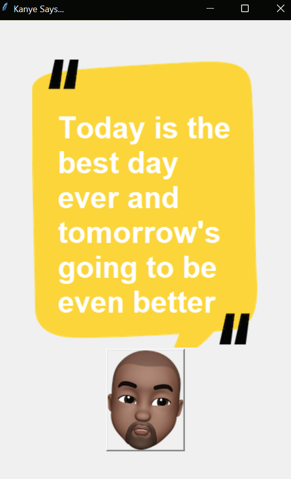

# Kanye Quotes Generator

Welcome to the Kanye Quotes Generator! 🎉 built with Python’s Tkinter and `requests` library, fetches and displays random quotes from Kanye West using the Kanye REST API. It provides a simple graphical user interface (GUI) to enjoy inspirational quotes from Kanye.    

## Features

- **Random Quotes**: Click a button to fetch a new Kanye West quote.
- **Interactive GUI**: Easy-to-use interface built with Tkinter.
- **Customizable Background**: The background image and button can be customized.

## Screenshots



## Installation

### Prerequisites

- Python 3.x
- `requests` library

### Clone the Repository

```bash
git clone git@github.com:shivashishyadav/kanye-project.git
cd kanye-quotes-generator
